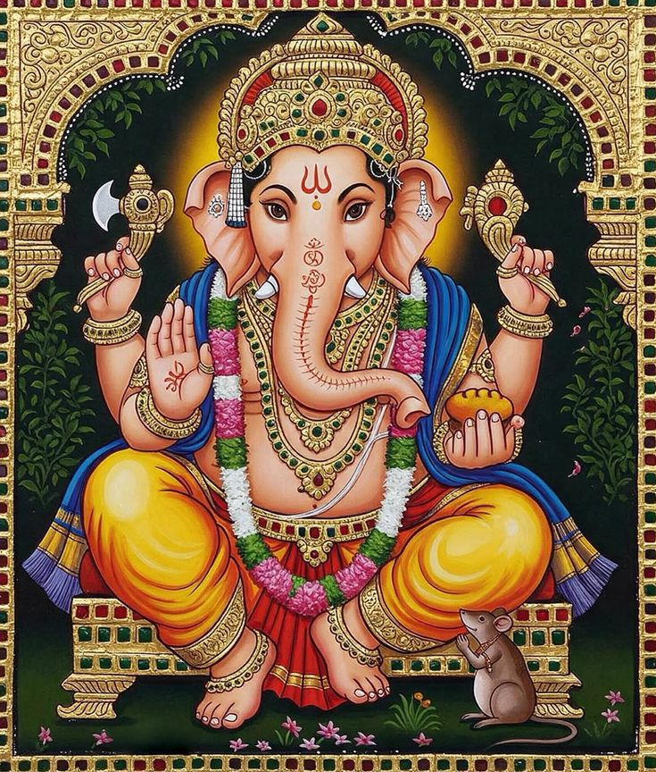

**॥ ॐ वक्रतुण्ड महाकाय सूर्यकोटि समप्रभ**

**निर्विघ्नं कुरु मे देव सर्वकार्येषु सर्वदा॥**

**Shri Ganapati Atharvashirsha**

**ॐ भद्रं कर्णेभिः शृणुयाम देवाः ।**

**भद्रं पश्येमाक्षभिर्यजत्राः ।**

**स्थिरैरङ्गैस्तुष्टुवांसस्तनूभिः ।**

**व्यशेम देवहितं यदायुः ।**

**Word-by-word meaning: ॐ** sacred syllable, **भद्रम्** auspicious,
**कर्णेभिः** with ears, **शृणुयाम** may we hear, **देवाः** O gods, **भद्रम्**
auspicious, **पश्येम** may we see, **अक्षभिः** with eyes, **यजत्राः** O
worshipful ones, **स्थिरैः** firm, **अङ्गैः** with limbs, **तुष्टुवांसः**
praising, **तनूभिः** with bodies, **व्यशेम** may we live, **देव-हितम्**
pleasing to the gods, **यत्** which, **आयुः** life

तुष्टुवांसः - तुष्टुवस् शब्दः प्र​.बहु

**Anvaya:** **हे देवाः! कर्णेभिः भद्रं शृणुयाम। हे यजत्राः! अक्षभिः भद्रं पश्येम। स्थिरैः
अङ्गैः तनूभिः यत् देवहितं तुष्टुवांसः आयुः व्यशेम।**

**Literal meaning of the anvaya: हे देवाः! कर्णेभिः भद्रं शृणुयाम** O gods, May
we hear what is auspicious with our ears. **हे यजत्राः!** **अक्षभिः भद्रं
पश्येम** O you who are worthy of worship! May we see what is auspicious
with our eyes. **स्थिरैः अङ्गैः तनूभिः** With firm limbs and bodies, **यत्
देवहितं** that is beneficial to the gods, **तुष्टुवांसः** engaged in praise,
**आयुः व्यशेम** may we live the lifespan.

**Simple meaning:** O divine beings, may we hear and see only what is
auspicious. May our bodies be strong and engaged in righteous activity.
May we live our full life in a way that is harmonious with divine will.

**स्वस्ति न इन्द्रो वृद्धश्रवाः ।**

**स्वस्ति नः पूषा विश्ववेदाः ।**

**स्वस्ति नस्तार्क्ष्यो अरिष्टनेमिः ।**

**स्वस्ति नो बृहस्पतिर्दधातु ॥**

**ॐ शान्तिः शान्तिः शान्तिः ॥**

**Word-by-word meaning:** **स्वस्ति** auspiciousness, **नः** for us,
**इन्द्रः** Indra, **वृद्ध-श्रवाः** of great fame, **स्वस्ति** auspiciousness,
**नः** for us, **पूषा** Pusha, **विश्व-वेदाः** knower of all, **स्वस्ति**
auspiciousness, **नः** for us, **तार्क्ष्यः** Tarkshya (Garuda),
**अरिष्ट-नेमिः** destroyer of obstacles, **स्वस्ति** auspiciousness, **नः**
for us, **बृहस्पतिः** Brihaspati, **दधातु** may bestow, **ॐ** sacred
syllable, **शान्तिः** peace, **शान्तिः** peace, **शान्तिः** peace

अरिष्टनेमिः , पुं, अरिष्टस्य नेमिः, षष्ठीतत्पुरुषः src. Kosha Ashtadhyayi

**Anvaya:** **वृद्धश्रवाः इन्द्रः नः स्वस्ति (दधातु)। विश्ववेदाः पूषा नः स्वस्ति
(दधातु)। अरिष्टनेमिः तार्क्ष्यः नः स्वस्ति (दधातु)। बृहस्पतिः नः स्वस्ति दधातु। ॐ
शान्तिः शान्तिः शान्तिः।**

**Literal meaning of the anvaya: वृद्धश्रवाः इन्द्रः** Of great renown Indra,
**नः स्वस्ति (दधातु)** may grant us auspiciousness. **विश्ववेदाः पूषा** the
knower of all Pusha - the Sun God, **नः स्वस्ति (दधातु)** may grant us
auspiciousness. **अरिष्टनेमिः तार्क्ष्यः** the destroyer of obstacles,
Tarkshya (Garuda), **नः स्वस्ति (दधातु)** may grant us auspiciousness.
**बृहस्पतिः** Brihaspati, **नः स्वस्ति दधातु** may grant us auspiciousness.
**ॐ शान्तिः शान्तिः शान्तिः** Om, peace, peace, peace.

**Simple meaning:** May Indra of great renown grant us auspiciousness.
May Pusha, the Sun God, the knower of all, grant us auspiciousness. May
Tarshya (Garuda), the destroyer of obstacles, grant us auspiciousness.
May Brihaspati grant us auspiciousness. Om, peace, peace, peace.

**ॐ नमस्ते गणपतये ।**

**त्वमेव प्रत्यक्षं तत्त्वमसि । त्वमेव केवलं कर्ताऽसि ।**

**त्वमेव केवलं धर्ताऽसि । त्वमेव केवलं हर्ताऽसि ।**

**त्वमेव सर्वं खल्विदं ब्रह्मासि । त्वं साक्षादात्माऽसि नित्यम् ॥1॥**

**Word-by-word meaning:**
**ॐ** sacred syllable, **नमः** salutations, **ते** to
you, **गणपतये** to Ganapati, **त्वम्** you, **एव** indeed,
**प्रत्यक्षम्** directly perceptible, **तत्त्वम्** ultimate reality, **असि**
are, **त्वम्** you, **एव** alone, **केवलम्** exclusively, **कर्ता** doer,
**असि** are, **त्वम्** you, **एव** alone, **केवलम्** exclusively, **धर्ता**
sustainer, **असि** are, **त्वम्** you, **एव** alone, **केवलम्** exclusively,
**हर्ता** remover, **असि** are, **त्वम्** you, **एव** alone, **सर्वम्** all,
**खलु** indeed, **इदम्** this, **ब्रह्म** supreme reality, **असि** are,
**त्वम्** you, **साक्षात्** evidently, **आत्मा** the Self, **असि** are,
**नित्यम्** eternal

**Anvay:** **ॐ गणपतये ते नमः। ****त्वम् एव प्रत्यक्षं
तत्त्वम् असि। त्वम् एव केवलं कर्ता असि। त्वम् एव केवलं धर्ता असि। त्वम् एव केवलं हर्ता
असि। त्वम् एव सर्वम् इदं खलु ब्रह्म असि। त्वं साक्षात् नित्यम् आत्मा असि।**

**Literal meaning of the anvaya:** **ॐ** Om,
**गणपतये** to Ganapati,
**ते** to you,
**नमः** salutations. **त्वम् एव** You alone,
**प्रत्यक्षं तत्त्वम् असि** are the directly perceptible truth. **त्वम् एव** You
alone **केवलं कर्ता असि** are the sole doer. **त्वम् एव** You alone, **केवलं
धर्ता असि** are the sole sustainer. **त्वम् एव** You alone, **केवलं हर्ता
असि** are the sole remover. **त्वम् एव** You alone, **सर्वम् इदं खलु** indeed
are all this, **ब्रह्म असि** and are Brahman. **त्वं साक्षात्** You are
evidently, **नित्यम् आत्मा असि** the eternal Self.

**Simple meaning:** I offer my reverential
salutations to you, Lord Ganapati. You alone are the directly
perceptible ultimate reality. All actions ultimately originate from you
alone. You alone support and sustain the entire universe. You alone
dissolve and withdraw creation at the appropriate time. You are
everything in this universe and are identical with the Supreme Brahman.
You are the eternal inner Self, directly experienced within all beings.

**ऋतं वच्मि । सत्यं वच्मि ।**

**अव त्वं माम् । अव वक्तारम् । अव श्रोतारम् ॥2॥**

**Word-by-word meaning:** **ऋतम्** truth, **वच्मि** I speak, **सत्यम्**
truth, **वच्मि** I speak, **अव** protect, **त्वम्** you, **माम्** me, **अव**
protect, **वक्तारम्** the speaker, **अव** protect, **श्रोतारम्** the
listener

**Anvaya:** **ऋतं वच्मि। सत्यं वच्मि। त्वं माम् अव। वक्तारम् अव। श्रोतारम् अव।**

**Literal meaning of the anvaya:** **ऋतं वच्मि** I speak the truth. **सत्यं
वच्मि** I speak the truth. **त्वं** You, **माम् अव** protect me. **वक्तारम्
अव** Protect the speaker. **श्रोतारम् अव** Protect the listener.

**Simple meaning:** I declare the absolute truth. I state what is true
and real. O Lord Ganapati, please protect me. Please protect the one who
recites this hymn. Please protect those who listen to this sacred text.

**अव दातारम् । अव धातारम् । अवानूचानमव शिष्यम् ।**

**अव पश्चात्तात् । अव पुरस्तात् । अव उत्तरात्तात् । अव दक्षिणात्तात् ।**

**अव चोर्ध्वात्तात् । अवाधरात्तात् । सर्वतो मां पाहि पाहि समन्तात् ॥3॥**

**Word-by-word meaning:** **अव** protect, **दातारम्** the giver, **अव**
protect, **धातारम्** the supporter, **अव** protect, **अनुचानम्**
one devoted to study, learned; especially one well
versed in the Vedas with their Angas so as to be able to repeat, read
and teach them, **अव** protect, **शिष्यम्** the disciple, **अव**
protect, **पश्चात्तात्** from behind (or west), **अव** protect, **पुरस्तात्**
from the front, **अव** protect, **उत्तरात्तात्** from the north, **अव**
protect, **दक्षिणात्तात्** from the south, **अव** protect, **च** and,
**ऊर्ध्वात्तात्** from above, **अव** protect, **अधरात्तात्** from below,
**सर्वतः** from all sides, **माम्** me, **पाहि** protect, **पाहि**
protect, **समन्तात्** completely on all sides

पश्चात् (अव्ययम्) - पश्चिमदिक् src. Kosha Ashtadhyayi

**Anvaya:** **दातारम् अव। धातारम् अव। अनुचानम् अव। शिष्यम् अव। पश्चात्तात् अव।
पुरस्तात् अव। उत्तरात्तात् अव। दक्षिणात्तात् अव। च ऊर्ध्वात्तात् अव। अधरात्तात् अव।
सर्वतः समन्तात् मां पाहि पाहि।**

**Literal meaning of the anvaya:** **दातारम् अव** Protect the giver.
**धातारम् अव** Protect the supporter. **अनुचानम् अव** Protect the
one devoted to study, learned; especially one well
versed in the Vedas with their Angas so as to be able to repeat, read
and teach them. **शिष्यम् अव** Protect the disciple. **पश्चात्तात्
अव** Protect from behind. **पुरस्तात् अव** Protect from the front.
**उत्तरात्तात् अव** Protect from the north. **दक्षिणात्तात् अव** Protect from
the south. **च ऊर्ध्वात्तात् अव** And protect from above. **अधरात्तात् अव**
Protect from below. **सर्वतः समन्तात्** From all sides, completely, **मां
पाहि पाहि** protect me, protect me.

**Simple meaning:** Please protect the one who offers or teaches this
sacred knowledge. Please protect the one who supports and upholds this
teaching. Please protect the disciple who studies this sacred text.
Please protect the devoted student who follows this teaching. Please
protect me from all dangers coming from behind. Please protect me from
all dangers coming from the front. Please protect me from dangers
arising from the northern direction. Please protect me from dangers
coming from the southern direction. Please protect me from all dangers
coming from above. Please protect me from dangers coming from below. O
Lord Ganapati, please protect me fully from all directions.

**त्वं वाङ्मयस्त्वं चिन्मयः। त्वमानन्दमयस्त्वं ब्रह्ममयः।**

**त्वं सच्चिदानन्दाद्वितीयोऽसि। त्वं प्रत्यक्षं ब्रह्मासि।**

**त्वं ज्ञानमयो विज्ञानमयोऽसि॥4॥**

**Word-by-word meaning:** **त्वम्** you, **वाङ्मयः** constituted of speech,
**त्वम्** you, **चिन्मयः** constituted of consciousness, **त्वम्** you,
**आनन्दमयः** full of bliss, **त्वम्** you, **ब्रह्ममयः** consisting of Veda,
**त्वम्** you, **सत्-चित्-आनन्दः** existence, consciousness, bliss,
**अद्वितीयः** non-dual, **असि** are, **त्वम्** you, **प्रत्यक्षम्** directly
perceptible, **ब्रह्म** supreme reality, **असि** are, **त्वम्** you,
**ज्ञानमयः** full of knowledge, **विज्ञानमयः** full of realized knowledge,
**असि** are

वाङ्मय वाङ्मय a. (यी f.) 1 Consisting of words;—2 Relating to speech or
words;—3 Endowed with speech.—4 Eloquent, rhetorical, oratorical. Src.
Kosha Ashtadhyayi

चिन्मय चिन्मय a. Consisting of pure intelligence, spiritual (as the
Supreme spirit).—यं 1 Pure intelligence.—2 The Supreme spirit. Src. Kosha
Ashtadhyayi

ब्रह्ममय a. 1 Consisting of or derived from, the Veda, belonging to the
Veda or spiritual pre-eminence;

**Anvaya:** **त्वं वाङ्मयः, त्वं चिन्मयः। त्वम् आनन्दमयः, त्वं ब्रह्ममयः। त्वम्
अद्वितीयः सच्चिदानन्दः असि। त्वं प्रत्यक्षं ब्रह्म असि। त्वं ज्ञानमयः विज्ञानमयः असि।**

**Literal meaning of the anvaya:** **त्वं वाङ्मयः** You are composed of
speech, **त्वं चिन्मयः** you are composed of consciousness. **त्वम् आनन्दमयः**
You are full of bliss, **त्वं ब्रह्ममयः** you consist of Vedas. **त्वम्
अद्वितीयः सच्चिदानन्दः असि** You are the non-dual
existence-consciousness-bliss. **त्वं प्रत्यक्षं ब्रह्म असि** You are directly
perceptible Brahman. **त्वं ज्ञानमयः** You are full of knowledge,
**विज्ञानमयः असि** and full of realized wisdom.

**Simple meaning:** You are the essence of sacred sound and pure
consciousness. You are absolute bliss and consist of Vedas. You are the
one, non-dual reality of existence, consciousness, and bliss. You are
Brahman experienced directly in visible form. You are both knowledge
itself and its direct realization.

**सर्वं जगदिदं त्वत्तो जायते । सर्वं जगदिदं त्वत्तस्तिष्ठति ।**

**सर्वं जगदिदं त्वयि लयमेष्यति । सर्वं जगदिदं त्वयि
प्रत्येति ।**

**त्वं भूमिरापोऽनलोऽनिलो नभः । त्वं चत्वारि वाक्पदानि ॥5॥**

**Word-by-word meaning:** **सर्वम्** all, **जगत्** universe, **इदम्** this,
**त्वत्तः** from you, **जायते** arises, **सर्वम्** all, **जगत्** universe,
**इदम्** this, **त्वत्तः** from you, **तिष्ठति** exists, **सर्वम्** all,
**जगत्** universe, **इदम्** this, **त्वयि** in you, **लयम्** dissolution,
**एष्यति** will enter, **सर्वम्** all, **जगत्** world universe, **इदम्**
this, **त्वयि** in you, **प्रत्येति** returns merges, **त्वम्** you, **भूमिः**
earth, **आपः** waters, **अनलः** fire, **अनिलः** air, **नभः** space
ether, **त्वम्** you, **चत्वारि** four, **वाक्** speech, **पदानि** forms
divisions

**Anvaya: इदं सर्वं जगत् त्वत्तः जायते। इदं सर्वं जगत् त्वत्तः तिष्ठति। इदं सर्वं जगत्
त्वयि लयम् एष्यति। इदं सर्वं जगत् त्वयि प्रत्येति। त्वं भूमिः आपः अनलः अनिलः नभः च ।
त्वं चत्वारि वाक्पदानि ।**

**Literal meaning of the anvaya:** **इदं सर्वं जगत्** This entire universe,
**त्वत्तः जायते** arises from you.

**इदं सर्वं जगत्** This entire universe, **त्वत्तः तिष्ठति** exists because of
you. **इदं सर्वं जगत्** This entire universe, **त्वयि लयम् एष्यति** will
dissolve into you. **इदं सर्वं जगत्** This entire universe **त्वयि प्रत्येति**
returns into you. **त्वं भूमिः आपः अनलः अनिलः नभः च** You are earth, water,
fire, air, and space; **त्वं चत्वारि वाक्पदानि** you are also the four forms
of speech.

**Simple meaning:** All creation originates from you alone. The universe
is sustained by your power. At the end of time, everything will merge
back into you. Everything in this universe returns to you. You yourself
are the five elements, and you also manifest as the four levels of
speech.

**त्वं गुणत्रयातीतः । त्वं अवस्थात्रयातीतः । त्वं देहत्रयातीतः ।**

**त्वं कालत्रयातीतः । त्वं मूलाधारस्थितोऽसि नित्यम् । त्वं**

**शक्तित्रयात्मकः ।त्वां योगिनो ध्यायन्ति नित्यम् । त्वं ब्रह्मा त्वं**

**विष्णुस्त्वं रुद्रस्त्वमिन्द्रस्त्वमग्निस्त्वं वायुस्त्वं सूर्यस्त्वं**

**चन्द्रमास्त्वं ब्रह्म भूर्भुवः स्वरोम् ॥ ६॥**

**Word-by-word meaning: त्वम्** you, **गुण-त्रय-अतीतः** beyond the three
gunas, **त्वम्** you, **अवस्था-त्रय-अतीतः** beyond the three states, **त्वम्**
you, **देह-त्रय-अतीतः** beyond the three bodies, **त्वम्** you,
**काल-त्रय-अतीतः** beyond the three times, **त्वम्** you, **मूल-आधार-स्थितः**
abiding in the muladhara, **असि** are, **नित्यम्** always, **त्वम्** you,
**शक्ति-त्रय-आत्मकः** consisting of three powers, **त्वाम्** you, **योगिनः**
yogis, **ध्यायन्ति** meditate upon, **नित्यम्** always, **त्वम्** you,
**ब्रह्मा** Brahma, **त्वम्** you, **विष्णुः** Vishnu, **त्वम्** you, **रुद्रः**
Rudra, **त्वम्** you, **इन्द्रः** Indra, **त्वम्** you, **अग्निः** Agni,
**त्वम्** you, **वायुः** Vayu, **त्वम्** you, **सूर्यः** Sun, **त्वम्** you,
**चन्द्रमाः** Moon, **त्वम्** you, **ब्रह्म** absolute reality, **भूः** earth
plane, **भुवः** atmosphere plane, **स्वः** heaven plane, **ओम्** Om

**Anvaya: त्वं गुणत्रयातीतः अवस्थात्रयातीतः देहत्रयातीतः कालत्रयातीतः। त्वं नित्यं
मूलाधारस्थितः असि। त्वं शक्तित्रयात्मकः। योगिनः त्वां नित्यं ध्यायन्ति। त्वं ब्रह्मा
विष्णुः रुद्रः इन्द्रः अग्निः वायुः सूर्यः चन्द्रमाः। त्वं ब्रह्म भूः भुवः स्वः ओम्।**

**Literal meaning of the anvaya: त्वं गुणत्रयातीतः** You are beyond the
three gunas, **अवस्थात्रयातीतः** the three states, **देहत्रयातीतः** the
three bodies, **कालत्रयातीतः** and the three divisions of time. **त्वं नित्यं
मूलाधारस्थितः असि** You eternally abide in the muladhara. **त्वं
शक्तित्रयात्मकः** You are of the nature of three powers. **योगिनः त्वां नित्यं
ध्यायन्ति** Yogis always meditate upon you. **त्वं ब्रह्मा विष्णुः रुद्रः इन्द्रः
अग्निः वायुः सूर्यः चन्द्रमाः** You are Brahma, Vishnu, Rudra, Indra, Agni,
Vayu, the Sun, the Moon. **त्वं ब्रह्म भूः भुवः स्वः ओम्** You are Brahman, the
worlds, and Om.

**Simple meaning:** You transcend all limitations of nature, body, mind,
and time. Ever present in the spiritual center, you are the source of
all divine powers. Yogis constantly meditate on you, for you alone
appear as all gods, all worlds, and the sacred sound Om itself.

**गणादिं पूर्वमुच्चार्य वर्णादिंस्तदनन्तरम् । अनुस्वारः परतरः ।**

**अर्धेन्दुलसितम् । तारेण ऋद्धम् । एतत्तव मनुस्वरूपम् । गकारः**

**पूर्वरूपम् । अकारो मध्यमरूपम् । अनुस्वारश्चान्त्यरूपम् ।**

**बिन्दुरुत्तररूपम्। नादः सन्धानम् । संहिता सन्धिः । सैषा**

**गणेशविद्या । गणक ऋषिः । निचृद्गायत्री छन्दः ।**

**गणपतिर्देवता । ॐ गं गणपतये नमः ॥ ७॥**

**Word-by-word meaning: गण-आदिम्** the first letter of the word gana
**(ग्)**, **पूर्वम्** first, **उच्चार्य** having uttered, **वर्ण-आदिम्** the
first letter of the varnas **(अ)**, **तत्** that, **अनन्तरम्** afterwards,
**अनुस्वारः** anusvara nasal sound, **परतरः** supreme, **अर्ध-इन्दु-लसितम्**
adorned with half moon **( ँ)**, **तारेण** by a high tone, loud or shrill
note (taarasthayi note - high note), **ऋद्धम्** enriched, **एतत्** this,
**तव** your, **मनुः** mantra, **स्वरूपम्** essential form, **गकारः** letter
ga, **पूर्व-रूपम्** first form, **अकारः** letter a, **मध्यम-रूपम्** middle
form, **अनुस्वारः** nasal sound, **च** and, **अन्त्य-रूपम्** final form,
**बिन्दुः** bindu dot, **उत्तर-रूपम्** higher form, **नादः** subtle sound,
**सन्धानम्** union, **संहिता सन्धिः** combination and conjunction, **सा**
this, **एषा** indeed, **गणेश-विद्या** sacred knowledge of Ganesha, **गणकः
ऋषिः** the rishi who composed this stotra is Ganaka, **निचृत्-गायत्री
छन्दः** nichrit-gayatri is the chanda, **गणपतिः देवता** Lord Ganapati is
the deity, **ॐ** sacred syllable, **गं** bija syllable, **गणपतये** to
Ganapati, **नमः** salutations

## What गणादिम् really means here 

## 1. Break the word

- गण = gaṇa

- आदि = beginning, first

- गणादिम् = that which is at the beginning of “gaṇa”

So आदि here does not mean “group” or “Gaṇas” or “Gaṇapati”
philosophically.  
It means “the first sound of the word gaṇa.”

तार high (a note), loud, shrill (mn.) src. Kosha Ashtadyayi

### **Anvaya : गणादिं पूर्वम् उच्चार्य, तत् अनन्तरं वर्णादिम्। अनुस्वारः परतरः। अर्धेन्दुलसितं, तारेण ऋद्धम्। एतत् तव मनुः स्वरूपम्। गकारः पूर्वरूपम्। अकारः मध्यमरूपम्। अनुस्वारः च अन्त्यरूपम्। बिन्दुः उत्तररूपम्। नादः सन्धानम्। संहिता सन्धिः। एषा सा गणेशविद्या। गणकः ऋषिः। निचृद्गायत्री छन्दः। श्रीगणपतिः देवता। ॐ गं गणपतये नमः।**

### **Literal meaning of the anvaya: गणादिं पूर्वम् उच्चार्य** After first uttering the syllable “ga”, **तत् अनन्तरं वर्णादिम्** and then the letters that follow, **अनुस्वारः परतरः** the anusvara is supreme. **अर्धेन्दुलसितं** It is adorned with the half-moon, **तारेण ऋद्धम्** and enriched by the high note. **एतत् तव मनुः स्वरूपम्** This is the essential form of your mantra. **गकारः पूर्वरूपम्** The letter “ga” is the first form. **अकारः मध्यमरूपम्** The letter “a” is the middle form. **अनुस्वारः च अन्त्यरूपम्** The anusvara is the final form. **बिन्दुः उत्तररूपम्** The bindu is the higher form. **नादः सन्धानम्** Nada is the point of union. **संहिता सन्धिः** The combined sound itself is the conjunction. **एषा सा गणेशविद्या** This indeed is the sacred knowledge of Ganesha. **गणकः ऋषिः** Ganaka is the rishi who composed this. **निचृद्गायत्री छन्दः** Nichṛd Gayatri is the metre. **श्रीगणपतिः देवता** Lord Ganapati is the deity. **ॐ गं गणपतये नमः** Om, salutations to Ganapati with the bija “gam”.

### **Simple meaning:** This section explains the inner structure of Ganapati’s bija mantra “गं”. It shows how sound evolves from letters, nasal vibration, bindu, and subtle nada, revealing Ganapati as mantra itself. The mantra is complete with its seer, metre, deity, and bija, making it a fully empowered Vedic vidya.

**एकदंताय विद्महे वक्रतुण्डाय धीमहि।**

**तन्नो दंतिः प्रचोदयात् ॥ 8॥**

### **Word-by-word meaning: एक-दंताय** to the one-tusked Lord, **विद्महे** may we know, **वक्र-तुण्डाय** to the curved-trunked Lord, **धीमहि** we meditate, **तत्** that, **नः** our, **दंतिः** the tusked one, **प्रचोदयात्** may inspire

### **Anvaya: एकदंताय विद्महे। वक्रतुण्डाय धीमहि। तत् दंतिः नः प्रचोदयात्।**

### **Literal meaning of the anvaya: एकदंताय विद्महे** May we know the one-tusked Lord. **वक्रतुण्डाय धीमहि** We meditate upon the curved-trunked Lord. **तत् दंतिः नः प्रचोदयात्** May the tusked one inspire our intellect.

### **Simple meaning** May we recognize and contemplate Lord Ganapati, the one-tusked, curved-trunked remover of obstacles. May he illuminate and guide our understanding.

**एकदन्तं चतुर्हस्तं पाशमङ्कुशधारिणम् ।**

**रदं च वरदं हस्तैर्बिभ्राणं मूषकध्वजम् ।**

**रक्तं लम्बोदरं शूर्पकर्णकं रक्तवाससम् ।**

**रक्तगन्धानुलिप्ताङ्गं रक्तपुष्पैः सुपूजितम् ।**

**भक्तानुकम्पिनं देवं जगत्कारणमच्युतम् ।**

**आविर्भूतं च सृष्ट्यादौ प्रकृतेः पुरुषात्परम् ।**

**एवं ध्यायति यो नित्यं स योगी योगिनां वरः ॥9॥**

**Word-by-word meaning: एक-दन्तम्** one-tusked, **चतुः-हस्तम्** four-armed,
**पाश-अङ्कुश-धारिणम्** holder of noose and goad, **रदम्** tusk, **च** and,
**वरदम्** boon-giving, **हस्तैः** with hands, **बिभ्राणम्** bearing,
**मूषक-ध्वजम्** flag with an emblem of a mouse, **रक्तम्** red-hued,
**लम्ब-उदरम्** pot-bellied, **शूर्पकर्णकम्** large-eared like winnowing fans,
**रक्त-वाससम्** clothed in red, **रक्त-गन्ध-अनुलिप्त-अङ्गम्** one whose body is
anointed with fragrant red sandal paste, **रक्त-पुष्पैः** with red flowers,
**सुपूजितम्** well worshipped, **भक्त-अनुकम्पिनम्** devotees, compassionate to,
**देवम्** deity, **जगत्-कारणम्** universe, cause, **अच्युतम्** imperishable,
**आविर्भूतम्** manifested, **च** and, **सृष्टि-आदौ** at the beginning of
creation, **प्रकृतेः** beyond prakriti, **पुरुषात्** beyond purusha, **परम्**
supreme, **एवम्** thus, **ध्यायति** meditates, **यः** who, **नित्यम्**
always, **सः** he, **योगी** yogi, **योगिनाम्** of yogis, **वरः** best

रद - A tooth; tusk (of an elephant);

**Anvaya: एकदन्तं, चतुर्हस्तं, पाशाङ्कुशधारिणं, रदं च वरदं, हस्तैः मूषकध्वजं बिभ्राणं,
रक्तं, लम्बोदरं शूर्पकर्णकं, रक्तवाससं, रक्तगन्धानुलिप्ताङ्गं, रक्तपुष्पैः सुपूजितं, भक्तानुकम्पिनं
देवं, जगत्कारणम्, अच्युतं, सृष्ट्यादौ आविर्भूतं, प्रकृतेः पुरुषात् परम् — एवं यः नित्यं ध्यायति,
सः योगिनां वरः योगी (अस्ति)।**

### **Literal meaning of the anvaya: एकदन्तं** To the one having one tusk, **चतुर्हस्तं** to the one having four hands, **पाशाङ्कुशधारिणं** to the one bearing a noose and a goad, **रदं** to the one having a tusk, **च वरदं** and to the giver of boons, **हस्तैः मूषकध्वजं बिभ्राणं** to the one holding a flag emblem of a mouse on it with his hands, **रक्तं** to the red-colored one, **लम्बोदरं** to the one having a huge stomach, **शूर्पकर्णकं** to the one having ears like winnows, **रक्तवाससं** to the one wearing red color garments, **रक्तगन्धानुलिप्ताङ्गं** to the one anointed with red sandal paste, **रक्तपुष्पैः सुपूजितं** to the one worshipped by red colored flowers, **भक्तानुकम्पिनं देवं** to the one who is ever kind to his devotees, **जगत्कारणम्** to the one who is cause of the creation of the world, **अच्युतं** to the one who is imperishable, **सृष्ट्यादौ आविर्भूतं** to the one who has manifested before the creation of the world, **प्रकृतेः पुरुषात्** who is beyond Prakriti and Purusha, **परम्** to the one who is Supreme — **एवं** thus, **यः नित्यं ध्यायति** the one who regularly meditates, **सः** that person, **योगिनां वरः योगी (अस्ति)** is the best Yogi among all the Yogis.

### **Simple meaning:** He who meditates always on the one-tusked, four-armed Lord, who holds the noose and goad, bears the broken tusk and grants boons, whose banner bears a mouse, who is red in form, pot-bellied, large-eared, clothed in red, whose body is anointed with red fragrance and worshipped with red flowers, who is compassionate to devotees, the imperishable cause of the universe, who manifested at the beginning of creation and is beyond prakriti and purusha — that person becomes the greatest among yogis.

**नमो व्रातपतये नमो गणपतये नमः प्रमथपतये नमस्तेऽस्तु**

**लम्बोदराय एकदन्ताय विघ्ननाशिने शिवसुताय श्रीवरदमूर्तये**

**नमो नमः ॥10॥**

**Word-by-word meaning: नमः** salutations, **व्रात-पतये** to the lord of
groups, **नमः** salutations, **गण-पतये** to the lord of Ganas, **नमः**
salutations, **प्रमथ-पतये** to the lord of the pramathas (followers of
Shiva), **नमः** salutations, **ते** to you, **अस्तु** may it be,
**लम्ब-उदराय** to the pot-bellied one, **एक-दन्ताय** to the one-tusked
one, **विघ्न-नाशिने** to the destroyer of obstacles, **शिव-सुताय** to the
son of Shiva, **श्री-वरद-मूर्तये** to the embodiment who grants auspicious
boons, **नमः नमः** salutations

व्रात (पुंलिङ्गः) समूहः - src. Kosha. Ashtadhyayi

प्रमथ (पुंलिङ्गः) शिवानुचरः src. Kosha. Ashtadhyayi

**Anvaya: व्रातपतये गणपतये प्रमथपतये लम्बोदराय एकदन्ताय विघ्ननाशिने शिवसुताय
श्रीवरदमूर्तये ते नमः नमः।**

### **Literal meaning of the anvaya: व्रातपतये** To the lord of the groups, **गणपतये** To the lord of the Ganas, **प्रमथपतये** to the lord of the pramathas, **लम्बोदराय** to the one having pot-belly, **एकदन्ताय** to the one having one tusk, **विघ्ननाशिने** to the one who destroys all the obstacles, **शिवसुताय** to the son of Shiva, **श्रीवरदमूर्तये** to the one who grants auspicious boons, **ते** to you, **नमः नमः** salutations. 

**Simple meaning:** Salutations to Lord Ganesha — the leader of all
divine groups, the remover of obstacles, the son of Shiva, pot-bellied
and one-tusked, who graciously grants auspicious blessings to His
devotees.

**॥ फलश्रुति ॥**

**एतदथर्वशीर्षं योऽधीते स ब्रह्मभूयाय कल्पते ।**

**स सर्वविघ्नैर्न बाध्यते । स सर्वतः सुखमेधते । स पञ्चमहापापात् प्रमुच्यते ।**

**सायमधीयानो दिवसकृतं पापं नाशयति ।**

**प्रातरधीयानो रात्रिकृतं पापं नाशयति ।**

**सायं प्रातः प्रयुञ्जानः अपापो भवति । धर्मार्थकाममोक्षं च विन्दति ।**

**इदमथर्वशीर्षमशिष्याय न देयम् । यो यदि मोहाद् दास्यति स पापीयान् भवति ।
सहस्रावर्तनाद्यं यं यं काममधीते तं तमनेन साधयेत् ॥11॥**

**Word-by-word meaning:** **एतत्** this, **अथर्वशीर्षम्** Atharvashirsha,
**यः** who, **अधीते** studies or recites, **सः** he, **ब्रह्म-भूयाय** to the
state of Brahman, **कल्पते** becomes fit, **सः** he, **सर्व-विघ्नैः** by all
obstacles, **न** not, **बाध्यते** is afflicted, **सः** he, **सर्वतः** in
all ways, **सुखम्** happiness, **एधते** prospers, **सः** he,
**पञ्च-महापापात्** from the five great sins, **प्रमुच्यते** is freed, **सायम्**
in the evening, **अधीयानः** reciting, **दिवस-कृतम्** committed during the
day, **पापम्** sin, **नाशयति** destroys, **प्रातः** in the morning,
**अधीयानः** reciting, **रात्रि-कृतम्** committed during the night, **पापम्**
sin, **नाशयति** destroys, **सायम्** in the evening, **प्रातः** in the
morning, **प्रयुञ्जानः** practicing, **अपापः** free from sin, **भवति**
becomes, **धर्म-अर्थ-काम-मोक्षम्** righteousness, wealth, pleasure,
liberation, **च** and, **विन्दति** attains, **इदम्** this, **अथर्वशीर्षम्**
Atharvashirsha, **अशिष्याय** to an unqualified disciple, **न** not,
**देयम्** should be given, **यः** who, **यदि** if, **मोहात्** out of
delusion, **दास्यति** gives, **सः** he, **पापीयान्** more sinful, **भवति**
becomes, **सहस्र-आवर्तनात्** by a thousand recitations, **यम् यम्**
whichever, **कामम्** desire, **अधीते** studies with intent, **तम् तम्** all
those, **अनेन** by this, **साधयेत्** accomplishes

**Anvaya:** **यः एतत् अथर्वशीर्षम् अधीते सः ब्रह्मभूयाय कल्पते। सः सर्वविघ्नैः न
बाध्यते। सर्वतः सुखम् एधते च। पञ्चमहापापात् प्रमुच्यते। सायम् अधीयानः दिवसकृतं पापं
नाशयति, प्रातः अधीयानः रात्रिकृतं पापं नाशयति। सायं प्रातः प्रयुञ्जानः अपापः भवति।
धर्मार्थकाममोक्षं च विन्दति। इदम् अथर्वशीर्षम् अशिष्याय न देयम्। यः मोहात् यदि दास्यति
सः पापीयान् भवति। सहस्रावर्तनात् अधीते, यं यं कामम् तं तम् अनेन साधयेत्।**

**Literal meaning of the anvaya:** **यः एतत् अथर्वशीर्षम् अधीते** He who
studies this Atharvashirsha, **सः ब्रह्मभूयाय कल्पते** he becomes fit for the
state of Brahman. **सः सर्वविघ्नैः न बाध्यते** He is not afflicted by
obstacles, **सर्वतः सुखम् एधते** **च** prospers in happiness from all sides,
and **पञ्चमहापापात् प्रमुच्यते** is freed from the five great sins. **सायम्
अधीयानः दिवसकृतं पापं नाशयति** Reciting it in the evening destroys sins
committed during the day; **प्रातः अधीयानः रात्रिकृतं पापं नाशयति** reciting
it in the morning destroys sins committed during the night. **सायं
प्रातः** **प्रयुञ्जानः अपापः भवति** Practicing it both evening and morning,
one becomes sinless and **धर्मार्थकाममोक्षं च विन्दति** attains dharma,
artha, kama, and moksha. **इदम् अथर्वशीर्षम् अशिष्याय न देयम्** This
Atharvashirsha should not be given to an unqualified disciple; **यः
मोहात् यदि दास्यति** one who gives it out of delusion, **सः पापीयान् भवति**
he becomes more sinful. **सहस्रावर्तनात् अधीते** By a deep study from
thousand recitations , **यं यं कामम्** whatever desire, **तं तम् अनेन साधयेत्**
that desire is accomplished by this.

### **Simple meaning:** Whoever regularly studies the Ganapati Atharvashirsha attains spiritual elevation, freedom from obstacles, happiness, and release from grave sins. Reciting it daily—morning and evening—purifies all sins and leads to a life aligned with righteousness, prosperity, joy, and ultimately liberation. However, it should be taught only to worthy disciples. When recited with focused intention many times, it fulfills the devotee’s sincere desires.

**अनेन गणपतिमभिषिञ्चति स वाग्मी भवति ।  
चतुर्थ्यामनश्नन् जपति स विद्यावान् भवति ।  
इत्यथर्वणवाक्यम् ।  
ब्रह्माद्यावरणं विद्यान्न बिभेति कदाचनेति ॥12॥**

**Word-by-word meaning: अनेन** by this (Atharvashirsha), **गणपतिम्**
Ganapati, **अभिषिञ्चति** worships by ablution, **सः** he, **वाग्मी**
eloquent, **भवति** becomes, **चतुर्थ्याम्** on the fourth lunar day
(Chaturthi), **अनश्नन्** without eating, **जपति** recites, **सः** he,
**विद्यावान्** learned, **भवति** becomes, **इति** thus, **अथर्वण-वाक्यम्**
statement of the Atharva Veda, **ब्रह्म-आदि-आवरणम्** envelop of knowledge
beginning with Brahma, **विद्यात्** should know, **न** not, **बिभेति**
fears, **कदाचन्** at any time, **इति** thus

**Anvaya:** **अनेन गणपतिम् अभिषिञ्चति सः वाग्मी भवति। चतुर्थ्याम् अनश्नन् जपति सः
विद्यावान् भवति। इति अथर्वणवाक्यं ब्रह्माद्यावरणं विद्यात्। न कदाचन् बिभेति इति।**

### **Literal meaning of the anvaya: अनेन** With this (Atharvashirsha), **गणपतिम् अभिषिञ्चति** who worships Ganapati, **सः वाग्मी** **भवति** he becomes eloquent. **चतुर्थ्याम्** On the fourth lunar day (Chaturthi), **अनश्नन्** fasting, **जपति** who recites, **सः विद्यावान् भवति** he becomes learned. **इति अथर्वणवाक्यं ब्रह्माद्यावरणं** This word of Atharva Veda which is envelop of knowledge beginning with Brahma, **विद्यात्** one should know. **न कदाचन् बिभेति इति** He lives without fear. 

**Simple meaning:** Worshipping Lord Ganapati through this
Atharvashirsha grants eloquence and clarity of speech. Reciting it with
discipline, especially on Chaturthi while fasting, bestows true
knowledge. These results are affirmed by the Atharva Veda itself, and
one who follows this sacred path lives without fear.

**यो दूर्वाङ्कुरैर्यजति स वैश्रवणोपमो भवति ।  
यो लाजैर्यजति स यशोवान् भवति स मेधावान् भवति ।  
यो मोदकसहस्रेण यजति स वाञ्छितफलमवाप्नोति ।  
यः साज्यसमिद्भिर्यजति स सर्वं लभते स सर्वं लभते ॥13॥**

**Word-by-word meaning: यः** who, **दूर्वा-अङ्कुरैः** with durva grass
shoots, **यजति** worships, **सः** he, **वैश्रवण-उपमः** equal to Kubera,
**भवति** becomes, **यः** who, **लाजैः** with parched grains, **यजति**
worships, **सः** he, **यशोवान्** renowned, **भवति** becomes, **सः** he,
**मेधावान्** intelligent, **भवति** becomes, **यः** who, **मोदक-सहस्रेण**
with a thousand modakas, **यजति** worships, **सः** he, **वाञ्छित-फलम्**
desired result, **अवाप्नोति** attains, **यः** who, **स-आज्य-समित्-भिः**
with fuel sticks smeared with ghee, **यजति** worships, **सः** he,
**सर्वम्** everything, **लभते** attains, **सः** he, **सर्वम्** everything,
**लभते** attains

**Anvaya:** **यः दूर्वाङ्कुरैः यजति सः वैश्रवणोपमः भवति। यः लाजैः यजति सः यशोवान्
भवति सः मेधावान् भवति। यः मोदकसहस्रेण यजति सः वाञ्छितफलम् अवाप्नोति। यः
साज्यसमिद्भिः यजति सः सर्वम् लभते सः सर्वम् लभते।**

### **Literal meaning of the anvaya: यः दूर्वाङ्कुरैः यजति सः वैश्रवणोपमः भवति** He who worships with durva grass become like Kubera. **यः लाजैः यजति** He who worships with parched grains, **सः यशोवान् भवति** he becomes renowned, **सः मेधावान् भवति** he becomes intelligent. **यः मोदकसहस्रेण यजति** He who worships with a thousand modakas, **सः वाञ्छितफलम् अवाप्नोति** he attains the desired result. **यः साज्यसमिद्भिः यजति** He who worships with ghee-smeared fuel sticks, **सः सर्वम् लभते सः सर्वम् लभते** he attains everything — indeed, attains everything.

**Simple meaning:** He who worships with durva grass becomes wealthy
like Kubera. He who worships with parched grains becomes renowned and
intelligent. He who worships with a thousand modakas attains the desired
result. He who worships with ghee-smeared fuel sticks attains everything
— indeed, attains everything.

**अष्टौ ब्राह्मणान् सम्यग् ग्राहयित्वा सूर्यवर्चस्वी भवति ।  
सूर्यग्रहे महानद्यां प्रतिमासन्निधौ वा जप्त्वा सिद्धमन्त्रो भवति ।  
महाविघ्नात् प्रमुच्यते । महादोषात् प्रमुच्यते ।  
महापापात् प्रमुच्यते । महाप्रत्यवायात् प्रमुच्यते ।  
स सर्वविद् भवति स सर्वविद् भवति ।  
य एवं वेद । इत्युपनिषत् ॥14॥**

**Word-by-word meaning: अष्टौ** eight, **ब्राह्मणान्** Brahmanas, **सम्यक्**
properly, **ग्राहयित्वा** having caused to recite, **सूर्य-वर्चस्वी** radiant
like the sun, **भवति** becomes, **सूर्य-ग्रहे** during a solar eclipse,
**महा-नद्याम्** in a great river, **प्रतिमा-सन्निधौ** near an image (of the
deity), **वा** or, **जप्त्वा** having recited, **सिद्ध-मन्त्रः** perfected in
mantra, **भवति** becomes, **महा-विघ्नात्** from great obstacles,
**प्रमुच्यते** is freed, **महा-दोषात्** from great faults, **प्रमुच्यते** is
freed, **महा-पापात्** from great sins, **प्रमुच्यते** is freed,
**महा-प्रत्यवायात्** from great adverse consequences, **प्रमुच्यते** is freed,
**सः** he, **सर्व-विद्** all-knowing, **भवति** becomes, **सः** he,
**सर्व-विद्** all-knowing, **भवति** becomes, **यः** who, **एवम्** thus,
**वेद** knows, **इति** thus, **उपनिषत्** Upanishad

**Anvaya: अष्टौ ब्राह्मणान् सम्यक् ग्राहयित्वा सूर्यवर्चस्वी भवति। सूर्यग्रहे महानद्याम्
प्रतिमासन्निधौ वा जप्त्वा सिद्धमन्त्रः भवति। महाविघ्नात् प्रमुच्यते महादोषात् प्रमुच्यते।
महापापात् प्रमुच्यते, महाप्रत्यवायात् प्रमुच्यते। सः सर्वविद् भवति सः सर्वविद् भवति। यः
एवं वेद। इति उपनिषत्।**

### **Literal meaning of the anvaya: अष्टौ ब्राह्मणान् सम्यक् ग्राहयित्वा** Having properly caused eight Brahmanas to recite this, **सूर्यवर्चस्वी भवति** one becomes radiant like the sun. **सूर्यग्रहे** During a solar eclipse, **महानद्याम्** near a great river, **प्रतिमासन्निधौ वा** or near an image of Ganapati, **जप्त्वा** after reciting, **सिद्धमन्त्रः भवति** one becomes perfected in mantra. **महाविघ्नात् प्रमुच्यते** One is freed from great obstacles, **महादोषात् प्रमुच्यते** One is freed from great faults. **महापापात् प्रमुच्यते** One is freed from great sins. **महाप्रत्यवायात् प्रमुच्यते** One is freed from great negative consequences. **सः सर्वविद् भवति सः सर्वविद् भवति** He becomes all-knowing — indeed, all-knowing, **यः एवं वेद** who thus understands this. **इति उपनिषत्** This is the Upanishad.

**Simple meaning:** Having properly caused eight Brahmanas to recite
this, one becomes radiant like the sun. Reciting it during a solar
eclipse, near a great river, or near an image, one becomes perfected in
mantra. One is freed from great obstacles, great faults, great sins, and
great negative consequences. He becomes all-knowing — indeed,
all-knowing — who thus understands this. This is the Upanishad.

**ॐ भद्रं कर्णेभिः शृणुयाम देवाः ।**

**भद्रं पश्येमाक्षभिर्यजत्राः ।**

**स्थिरैरङ्गैस्तुष्टुवांसस्तनूभिः ।**

**व्यशेम देवहितं यदायुः ।**

**Word-by-word meaning: ॐ** sacred syllable, **भद्रम्** auspicious,
**कर्णेभिः** with ears, **शृणुयाम** may we hear, **देवाः** O gods, **भद्रम्**
auspicious, **पश्येम** may we see, **अक्षभिः** with eyes, **यजत्राः** O
worshipful ones, **स्थिरैः** firm, **अङ्गैः** with limbs, **तुष्टुवांसः**
praising, **तनूभिः** with bodies, **व्यशेम** may we live, **देव-हितम्**
pleasing to the gods, **यत्** which, **आयुः** life

तुष्टुवांसः - तुष्टुवस् शब्दः प्र​.बहु

**Anvaya:** **हे देवाः! कर्णेभिः भद्रं शृणुयाम। हे यजत्राः! अक्षभिः भद्रं पश्येम। स्थिरैः
अङ्गैः तनूभिः यत् देवहितं तुष्टुवांसः आयुः व्यशेम।**

**Literal meaning of the anvaya: हे देवाः! कर्णेभिः भद्रं शृणुयाम** O gods, May
we hear what is auspicious with our ears. **हे यजत्राः!** **अक्षभिः भद्रं
पश्येम** O you who are worthy of worship! May we see what is auspicious
with our eyes. **स्थिरैः अङ्गैः तनूभिः** With firm limbs and bodies, **यत्
देवहितं** that is beneficial to the gods, **तुष्टुवांसः** engaged in praise,
**आयुः व्यशेम** may we live the lifespan.

**Simple meaning:** O divine beings, may we hear and see only what is
auspicious. May our bodies be strong and engaged in righteous activity.
May we live our full life in a way that is harmonious with divine will.

**ॐ पूर्णमदः पूर्णमिदं पूर्णात्पूर्णमुदच्यते ।**

**पूर्णस्य पूर्णमादाय पूर्णमेवावशिष्यते ॥**

**ॐ शान्तिः शान्तिः शान्तिः ॥**

**Word-by-word meaning: ॐ** sacred syllable, **पूर्णम्** complete, **अदः**
that (Brahman), **पूर्णम्** complete, **इदम्** this (manifest world),
**पूर्णात्** from the complete, **पूर्णम्** complete, **उदच्यते** arises,
**पूर्णस्य** of the complete, **पूर्णम्** complete, **आदाय** having taken,
**पूर्णम्** complete, **एव** indeed, **अवशिष्यते** remains, **ॐ** sacred
syllable, **शान्तिः** peace, **शान्तिः** peace, **शान्तिः** peace

**Anvaya: अदः पूर्णम्। इदं पूर्णम्। पूर्णात् पूर्णम् उदच्यते। पूर्णस्य पूर्णम् आदाय पूर्णम् एव
अवशिष्यते।**

**Literal meaning of the anvaya: अदः पूर्णम्** That (Outer World) is
complete (Full with Divine Consciousness); **इदं पूर्णम्** this (Inner
World) is complete (Full with Divine Consciousness). **पूर्णात्** From the
complete, **पूर्णम् उदच्यते** the complete arises (From the Fullness of
Divine Consciousness the World is manifested). **पूर्णस्य** Of the
complete, **पूर्णम् आदाय** even after taking the complete, **पूर्णम् एव
अवशिष्यते** the complete alone remains (Because Divine Consciousness is
Non-Dual and Infinite).

**Simple meaning:** Brahman is infinite and whole, and the universe that
emerges from it is also whole. Creation does not diminish the Absolute —
fullness remains untouched. May this understanding grant peace at the
physical, mental, and cosmic levels.

**॥ॐ गं गणपतये नमः॥**

**॥सर्वं श्रीकृष्णार्पणमस्तु॥**
